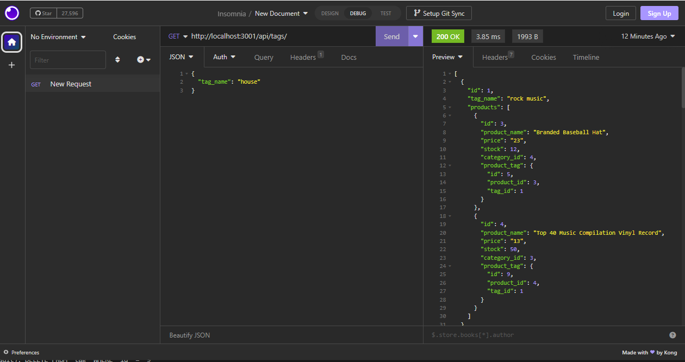

# Backend e-commerce

## Description

This application is a database for an e-commerce. It's using MySql and Sequelize.

## Installation

To run this application, you must first run npm install in your terminal. Then you will need to have mysql install on your computer. Once that is done, open your mysql terminal and run 'DROP DATABASE IF EXISTS ecommerce_db;' then run 'CREATE DATABASE ecommerce_db;'. Now you have your database on your system. Run 'npm run seed' to seed the data. Now open Insomnia and check the different routes.

## Usage

To use this application, simply open Insomnia after the installation is complete, and check the different routes like http://localhost:3001/api/tags, http://localhost:3001/api/categories or http://localhost:3001/api/products

Here is a link to a video showing the application in action. [Video](https://drive.google.com/file/d/1IrP1dJ2EdxhuWqIutf0dze1o7WNe9ucx/view)

## Credits

[Valerigionetnoel](https://github.com/Valerigionetnoel) you can email me [here](mailto:valeri.gionetnoel@gmail.com)

## License

Refer to license in repo for more information.